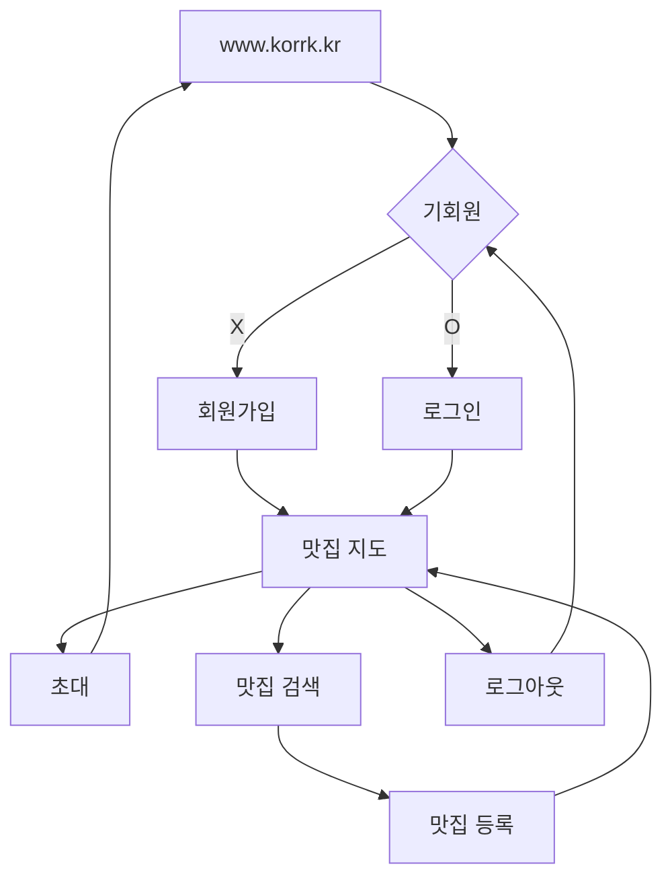

# [Korrk](https://www.korrk.kr/)

**꼬르륵(Korrk)** 은 **20,30 💼 직장인**들이 지인들과 함께 만드는 🍔 **음식점 지도**를 통해 **손쉬운 🙌 식당 선택**을 돕는 서비스입니다.

## Key Features

### 지도 홈 

저장해놓은 맛집들의 정보를 확인할 수 있습니다.

| 등록한 맛집 정보 | 지도 정보 및 초대하기 |
|---|---|
|  |  |

### 맛집 검색

검색어를 입력하면, 음식점들을 목록 또는 지도로 확인할 수 있습니다.

| 검색어 자동완성 및 검색 | 목록 및 지도 보기 |
|---|---|
|  |  |

### 맛집 상세 및 등록

맛집 상세 정보를 확인하고 맛집을 등록할 수 있습니다.

| 상세 정보 | 등록 | 좋아요 |
|---|---|---|
|  |  |  |

## User Flow

## Tech Stack

- 코어: React, TypeScript, Next.js
- 스타일링: Tailwind CSS
- 패키지 매니저: NPM
- 빌드: Webpack, SWC
- CI/CD: GitHub Actions, Vercel

## Related Repositories

- https://github.com/mash-up-kr/VitaminC_server
- https://github.com/mash-up-kr/VitaminC_manifest
