# [Korrk](https://www.korrk.kr/)

**꼬르륵(Korrk)** 은 **20,30 💼 직장인**들이 지인들과 함께 만드는 🍔 **음식점 지도**를 통해 **손쉬운 🙌 식당 선택**을 돕는 서비스입니다.

## Key Features

### 지도 홈

저장해놓은 맛집들의 정보를 확인할 수 있습니다.

| 등록한 맛집 정보                                                                                                                   | 지도 정보 및 초대하기                                                                                                               |
| ---------------------------------------------------------------------------------------------------------------------------------- | ----------------------------------------------------------------------------------------------------------------------------------- |
|  |  |

### 맛집 검색

검색어를 입력하면, 음식점들을 목록 또는 지도로 확인할 수 있습니다.

| 검색어 자동완성 및 검색                                                                                                                   | 목록 및 지도 보기                                                                                                                   |
| ----------------------------------------------------------------------------------------------------------------------------------------- | ----------------------------------------------------------------------------------------------------------------------------------- |
|  |  |

### 맛집 상세 및 등록

맛집 상세 정보를 확인하고 맛집을 등록할 수 있습니다.

| 상세 정보                                                                                                                       | 등록                                                                                                                               | 좋아요                                                                                                                                |
| ------------------------------------------------------------------------------------------------------------------------------- | ---------------------------------------------------------------------------------------------------------------------------------- | ------------------------------------------------------------------------------------------------------------------------------------- |
|  |  |  |

## User Flow

```mermaid
flowchart TD
    A[www.korrk.kr] --> B{기회원}
    B -->|X| C[회원가입]
    B -->|O| D[로그인]
    C --> E[맛집 지도]
    D --> E[맛집 지도]

    E --> F[초대] --> A
    E --> G[맛집 검색]
    E --> H[로그아웃]

    G --> I[맛집 등록] --> E
    H --> B
```

## Tech Stack

- 코어: React, TypeScript, Next.js
- 스타일링: Tailwind CSS
- 패키지 매니저: NPM
- 빌드: Webpack, SWC
- CI/CD: GitHub Actions, Vercel

## Related Repositories

- https://github.com/mash-up-kr/VitaminC_server
- https://github.com/mash-up-kr/VitaminC_manifest
